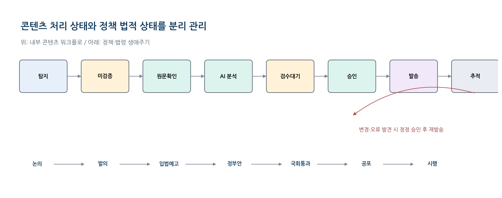

# 3. 정보 출처·수집·검증 정책

> 원본: 통합개발명세서 §3 · **이 장이 제품의 핵심 안전장치다.**

## 3.1 출처 권위 등급

| 등급 | 출처 유형 | 사용 원칙 |
| --- | --- | --- |
| A | 법령·관보·의안 원문 | 법적 상태, 공포일, 시행일, 조문 변경을 판단하는 최우선 근거 |
| B | 정부·공공기관 공식자료 | 신고 안내, 정책 발표, 지원사업 공고, 행정절차를 확인 |
| C | 전문기관·전문언론 | 실무 해설과 쟁점 파악. **A/B 출처 연결 전에는 확정 정보로 발송 금지** |
| D | 일반뉴스·블로그·SNS | 이슈 탐지와 현장 반응 분석만 수행. **단독 근거 사용 금지** |

## 3.2 정책 법적 상태(legal_status)

| 코드 | 표시명 | 발송 표현 규칙 |
| --- | --- | --- |
| `DISCUSSION` | 검토·논의 | 확정 아님. 변경 가능성을 명시 |
| `BILL_PROPOSED` | 법안 발의 | 국회 제출 단계. 통과·공포 전 |
| `PREANNOUNCED` | 입법·행정예고 | 의견수렴 중. 최종안 변경 가능 |
| `GOV_ANNOUNCED` | 정부안 발표 | 정부 추진안. 국회·하위법령 절차 필요 |
| `ASSEMBLY_PASSED` | 국회 통과 | 공포 및 시행일 확인 필요 |
| `PROMULGATED` | 공포 | 관보·법령 원문 확인 완료 |
| `EFFECTIVE` | 시행 | 현재 적용 기준 |
| `SUSPENDED` | 유예·효력정지 | 적용 중단 또는 유예 사유·기간 표시 |
| `ABOLISHED` | 폐지 | 폐지일·경과조치 표시 |
| `UNKNOWN` | 미확인 | 상태 확인 필요. 발송 시 확정 표현 금지 |

> `UNKNOWN`은 DB·API·AI 스키마에만 존재하는 초기값이며, 원본 표에는 표시명이 없다.
> 화면 라벨은 "상태 확인 필요"로 통일한다.

## 3.3 콘텐츠 워크플로 상태(workflow_status)

`DETECTED → UNVERIFIED → SOURCE_CONFIRMED → ANALYZED → REVIEW_PENDING → APPROVED → SCHEDULED → PUBLISHED → MONITORING`
분기: `CORRECTED`, `SUPERSEDED`, `ARCHIVED`

**두 상태축은 절대 하나로 합치지 않는다.** 워크플로 상태는 내부 처리 단계이고, 법적 상태는 외부 세계의 사실이다.
상태 전이 규칙 구현: [`app/domain/workflow.py`](../../backend/app/domain/workflow.py)

## 3.4 수집 방식

- 공식 Open API 또는 공개 데이터 인터페이스
- 기관이 제공하는 RSS·Atom·메일링 리스트
- 공식 목록·상세 HTML의 저빈도 수집
- 공식 첨부파일(PDF, HWP/HWPX, DOCX, XLSX) 수집
- 운영자 수동 등록 또는 전달받은 원문 등록

> **중요** — 자동수집 가능 여부와 이용조건은 출처별 기술조사에서 확인한다.
> robots.txt 우회, 로그인 우회, 과도한 요청, 캡차 우회는 **구현하지 않는다.**
> API가 없거나 자동수집이 불안정한 출처는 수동·메일 기반 운영으로 대체한다.

## 3.5 원문 저장 필수 필드

| 필드 | 필수 | 설명 |
| --- | --- | --- |
| `source_id` | Y | 출처 레지스트리 ID |
| `source_item_id` | 조건부 | 기관 게시물 번호·의안번호·공고번호 |
| `canonical_url` | Y | 정규화된 원문 URL |
| `title` | Y | 원문 제목 |
| `publisher` | Y | 발표기관 |
| `published_at` | Y | 발표·게시 시각 |
| `collected_at` | Y | 최초 수집 시각 |
| `last_checked_at` | Y | 최종 재확인 시각 |
| `content_hash` | Y | 정규화 본문 SHA-256 |
| `raw_html`/`text` | Y | 원문 또는 추출 텍스트 |
| `attachments` | 조건부 | 파일명, MIME, 해시, 저장경로 |
| `license_meta` | 조건부 | 공공누리·저작권·재배포 조건 |
| `http_meta` | N | ETag, Last-Modified, 응답코드 |
| `parser_version` | Y | 수집·파서 버전 |

## 3.6 중복·클러스터 판정

1. **1차 동일성**: `source_id` + `source_item_id` 또는 `canonical_url` 일치
2. **2차 동일성**: 첨부파일 해시 또는 정규화 본문 해시 일치
3. **3차 유사성**: 기관·발표일 근접 + 제목 유사도 + 핵심 엔터티 일치

- 동일 정책의 보도자료·입법예고·법령·관보는 삭제하지 않고 하나의 `policy_cluster`로 연결한다.
- 자동 병합은 높은 임계값에서만 수행하고, 애매한 경우 운영자 병합 큐로 전송한다.

## 3.7 검증 게이트 G1~G6

| 게이트 | 통과 조건 | 실패 시 처리 |
| --- | --- | --- |
| **G1 원문성** | 공식 URL 또는 공식 첨부파일 확인 | 미검증 큐 유지, 발송 금지 |
| **G2 상태성** | 정책 법적 상태와 기준일 확인 | 상태 확인 필요 표시 |
| **G3 날짜성** | 발표일·시행일·마감일 구분 | 날짜 필드 null 및 검수 필수 |
| **G4 적용성** | 대상·제외·경과조치 근거 확보 | 개인화 발송 제외 |
| **G5 교차검증** | 중요 콘텐츠는 2개 이상 독립 근거 또는 A등급 1개 | 전문가 승인 필수 |
| **G6 전문가 승인** | 고위험 항목 승인 완료 | 발송 스케줄 생성 금지 |

구현: [`app/domain/gates.py`](../../backend/app/domain/gates.py) — 순수 함수로 구현하여 DB 없이 단위 테스트한다.
인수 기준 대응: AT-03, AT-04, AT-05, AT-06.

## 3.8 신뢰도 점수 (source_confidence)

> 신뢰도 점수는 **사실의 확률이 아니라** 내부 처리 우선순위와 발송 제한을 위한 워크플로 점수다.
> 점수만으로 자동 확정하지 않는다.

| 구성 | 배점 | 예시 |
| --- | --- | --- |
| 출처 권위 | 0~40 | A 40, B 30, C 15, D 5 |
| 정책상태 명확성 | 0~25 | 공포·시행 25, 예고 15, 논의 5 |
| 교차검증 | 0~20 | 공식 근거 2개 이상 20 |
| 최신성·버전 | 0~10 | 최근 재확인·변경없음 |
| 전문가 검수 | 0~5 | 승인 완료 5 |

구현: [`app/domain/confidence.py`](../../backend/app/domain/confidence.py)
