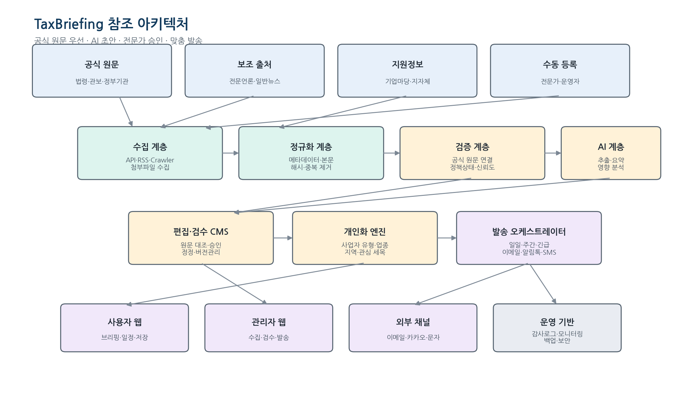

# 6. 시스템 아키텍처

> 원본: 통합개발명세서 §6

## 6.1 기술 스택

| 계층 | 권장안 | 대안/비고 | 이 저장소의 선택 |
| --- | --- | --- | --- |
| 웹 프론트 | Next.js 기반 반응형 웹 | Vue/Nuxt 가능. 관리자와 사용자 앱 분리 가능 | Next.js (S3 착수) |
| API | Python FastAPI | AI·문서처리 생태계 활용. NestJS 대안 | **FastAPI 0.115 / Python 3.12** |
| DB | PostgreSQL | JSONB, 전문검색, pgvector 선택 | **PostgreSQL 16** |
| 비동기 처리 | Redis + Celery/RQ 계열 | 관리형 큐(SQS/PubSub)로 교체 가능 | Redis 7 + Celery (S2) |
| 객체 저장 | S3 호환 스토리지 | 원문, 첨부, 발송 스냅샷 | MinIO (로컬) / S3 (운영) |
| 검색 | 초기 PostgreSQL FTS | 규모 증가 시 OpenSearch | PostgreSQL FTS |
| 배포 | 컨테이너 + 한국 리전 클라우드 | AWS 서울/NCP/GCP 등 사업조건에 맞춤 | Docker Compose (로컬) |
| 인증 | OIDC/JWT + 관리자 MFA | B2B SSO는 2단계 | JWT (HS256, S1) |
| 모니터링 | OpenTelemetry + 로그/메트릭 서비스 | Sentry 등 오류 추적 | structlog JSON (S1) |
| CI/CD | Git 기반 테스트·마이그레이션·배포 | dev/staging/prod 분리 | GitHub Actions (S2) |

## 6.2 서비스 컴포넌트

| 컴포넌트 | 책임 | 코드 위치 |
| --- | --- | --- |
| source-registry | 출처 설정, 이용조건, 수집주기, 어댑터 버전 | `app/api/v1/sources.py` |
| collector-worker | 목록·상세·첨부 수집, 재시도, rate limit | `app/workers/collector.py` (S2) |
| document-processor | 텍스트 추출, 메타데이터, 해시, 파일 검사 | `app/services/normalize.py` |
| dedup-cluster | 동일문서·동일정책 클러스터링 | `app/services/dedup.py` (S2) |
| verification-service | 근거 연결, 정책상태, 검증 게이트, 신뢰도 | `app/domain/gates.py`, `app/domain/confidence.py` |
| ai-analysis-service | 구조화 추출, 요약, 영향분석, 태그 | `app/services/ai/` |
| editorial-cms | 원문 대조, 편집, 검수, 승인, 정정 | `app/api/v1/contents.py`, `reviews.py` |
| profile-service | 사용자·사업자 프로필과 동의 | `app/api/v1/me.py` |
| personalization-service | 규칙 기반 대상선정·정렬 | `app/domain/personalization.py` |
| delivery-service | 캠페인, 템플릿, 채널 어댑터, 결과 수집 | `app/services/delivery/` (S3) |
| analytics-service | 열람·클릭·반송·상담·전환 지표 | (S3) |
| audit-service | 불변 감사 이벤트와 관리자 조회 | `app/core/audit.py` |

## 6.3 처리 파이프라인

1. 스케줄러가 출처 수집 작업을 큐에 등록한다.
2. 수집기는 원문과 첨부를 저장하고 `raw_content` 버전을 생성한다.
3. 정규화·중복 서비스가 동일문서와 관련 정책을 판별한다.
4. 검증 서비스가 공식 근거 연결 여부와 정책상태 후보를 계산한다.
5. AI 서비스가 구조화 결과를 생성하고 스키마·근거 검증을 수행한다.
6. CMS 검수자가 원문을 대조하고 승인한다.
7. 개인화 엔진이 수신 대상과 우선순위를 계산한다.
8. 발송 서비스가 채널별 메시지를 생성하고 공급자에 전달한다.
9. 발송 후 정책 원문을 재확인하고 변경 시 정정 플로우를 실행한다.

## 6.4 실패·재시도 정책

| 실패 지점 | 재시도 | 최종 처리 |
| --- | --- | --- |
| HTTP 수집 오류 | 지수 백오프 3~5회, 출처 rate limit 준수 | dead-letter 큐 및 운영 알림 |
| 파서 오류 | 동일 원문을 새 파서 버전으로 재처리 | 원문 링크와 수동 입력 제공 |
| 파일 추출 오류 | 형식별 대체 추출기 1회 | 검수자에게 파일 직접 확인 요청 |
| AI 오류·스키마 실패 | 동일 입력 최대 2회, 보수적 모델 대체 | **AI 미사용 수동 편집** |
| 발송 공급자 오류 | 공급자 정책 내 재시도 | 대체 채널 또는 실패 리포트 |
| 정정 실패 | 고우선 운영 알림 | 수동 캠페인 생성 |
